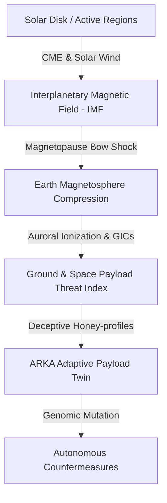

# ARKA: Autonomous, Evolving, Tamper-Proof Space Telemetry & Cyber-Physical Resiliency System

<div align="center">
  
</div>

## 🌌 Introduction & Welcome

Welcome to the official repository of **ARKA**, designed and engineered for the **Bharatiya Antariksh Hackathon 2026** (3rd Edition) — a prestigious national innovation initiative organized by the **Indian Space Research Organisation (ISRO)** and powered by **Hack2skill**.

🚀 **ARKA** (Sanskrit for *The Sun*) is an advanced, multi-dimensional, real-time simulation and telemetry analytics suite. It bridges **Space Weather Physics (Magnetohydrodynamics, Solar Flare forecasting)** and **Cyber-Physical Security (Spacecraft Payload Protection, Digital Twins, and Honey-deception Networks)** to ensure the resilience of next-generation satellite constellations and deep-space missions.

---

## 🔬 Core Scientific Foundations

ARKA models the complex dynamics of the solar-terrestrial environment and translates physical anomalies into predictive risk profiles for ground control and orbit operations.



### 1. Solar & Magnetohydrodynamics (MHD) Engine
ARKA computes real-time MHD simulations of high-energy plasma flows from the solar corona.
*   **Magnetic Flux Dynamics**: By tracking solar active regions, ARKA evaluates local shear gradients, non-force-free magnetic parameters, and localized magnetic helicity divergence ($\nabla \cdot \vec{H}_m$).
*   **Geomagnetic Shockfront Compressions**: Models the interaction between Coronal Mass Ejections (CMEs) and the Earth's magnetosphere bow shock. It calculates the compression interface using boundary jump conditions (Rankine-Hugoniot relations).
*   **Geomagnetically Induced Currents (GICs)**: Predicts potential GIC loops induced in high-latitude power grids and satellite sensor booms, mapping risk states directly to the Kp-index.

### 2. Space Cyber-Physical Threat Intelligence & Digital Twins
In deep-space operations, high ionizing radiation from solar storms can lead to Single Event Upsets (SEUs) or latch-ups, creating software vulnerabilities. Hackers or rogue agents can exploit these transient faults to intercept telemetry or inject malicious updates.
*   **Solar Digital Twin**: Evaluates payload security under heavy geomagnetic strain using predictive simulated loops of the instrument's software state.
*   **Autonomous Honey-deception (ARKA Genome)**: If a satellite payload segment or telemetry broadcast stream is compromised, ARKA deploys an *Autonomous, Evolving, Tamper-proof Honeypot Ecosystem with Reactive Intelligence*. Using Gemini 3.5 Flash, it synthesizes realistic, deceptive telemetry streams to mislead attackers while shielding actual spacecraft coordinates and sensor parameters.
*   **Mutating DNA Signatures**: Employs genetic sequence keys that mutate autonomously (`MUTATION_ACTIVE_MULE_...`) to continuously rotate decoy configurations, making it impossible for attackers to identify the real system interface.

---

## 🖥️ System Architecture & Views

The dashboard is structured into five cohesive mission-control modules:

### 1. Temporal Intelligence (`INTELLIGENCE`)
*   **Planetary Magnetosphere Visualization**: Real-time canvas rendering of the Earth's magnetic dipole loops, solar wind plasma sweeping around the bow shock, and ionization levels.
*   **Sensors & Spacecraft Telemetry**: High-frequency telemetry charts of active space weather sensors, including high-energy L1 Orbit Spectrometers (HEL1-OS) and 3-axis Interplanetary Magnetometers (MAG-771).

### 2. Magnetic Dynamics (`GENOME`)
*   **Geomagnetic Field lines & Plasma Flow**: Toggleable Three.js/WebGL simulations visualizing raw Magnetic Field lines, Plasma Velocity vector fields, Ion Temperature, and Loop Current Densities.
*   **Shield Deployment Terminal**: A critical interactive simulation where users can manually or autonomously deploy the high-flux electromagnetic shield to protect payloads from solar particle streams.

### 3. Breach Nexus (`NETWORK`)
*   **Cyber Spotlight Scanner**: A visual representation of global network nodes (Jamtara, Mumbai, Bengaluru, Chennai, Delhi) mapping real-time attack streams, bandwidth speeds, and decoy paths.
*   **Fraud Constellation & Graph**: Interactive force-directed network topology showing connection strengths between remote satellite gateways and ground proxy nodes.

### 4. Solar Digital Twin (`APK_LAB`)
*   **Malware Decompile Laboratory**: High-performance reverse engineering environment. Users can upload or simulate Android APK payloads (such as banking trojans like *Anubis* or *Cerberus*) to analyze critical permissions (`RECEIVE_SMS`, `SYSTEM_ALERT_WINDOW`) and generate Explainable AI (XAI) security mitigations.

### 5. Solar Oracle (`FORECAST`)
*   **Temporal Projection Timeline**: Simulates future space weather risks and potential geomagnetic anomalies.
*   **Scenario Plays**: Fully autonomous mode demonstrating simulated CME strikes, payload shields, telemetry intercepts, and subsequent honeypot redirection.

---

## 🛠️ Installation & Running Locally

ARKA is built using a modern, reactive stack designed for real-time visualization and minimal latency.

### Prerequisites
*   [Node.js](https://nodejs.org/) (v18.0.0 or higher recommended)
*   An active internet connection (if integrating live LLM telemetry via Gemini)

### Step-by-Step Setup

1.  **Clone the Repository**:
    ```bash
    git clone https://github.com/gurarpitzz/ARKA-ISRO.git
    cd ARKA-ISRO
    ```

2.  **Install Dependencies**:
    ```bash
    npm install
    ```

3.  **Configure Environment Variables**:
    Create a `.env` file in the root directory (or copy from `.env.example`):
    ```bash
    GEMINI_API_KEY=your_gemini_api_key_here
    ```

4.  **Run Development Server**:
    Start the Vite-bundled Express server (powered by `tsx`):
    ```bash
    npm run dev
    ```
    Open `http://localhost:3000` in your web browser to access the ARKA Mission Control panel.

5.  **Build for Production**:
    To compile the React front-end and the Node.js back-end:
    ```bash
    npm run build
    npm start
    ```

---

## 🛰️ Bharatiya Antariksh Hackathon 2026
This project represents a vision for secure space infrastructure. As India ventures further into space with Chandrayaan, Gaganyaan, and Aditya-L1, protecting our assets from both spatial storms and cyber threats is paramount. ARKA provides the shield and the sword for space-cyber security.

*Developed with ❤️ for ISRO, under the theme: Space Technology & Space Cyber Security.*
